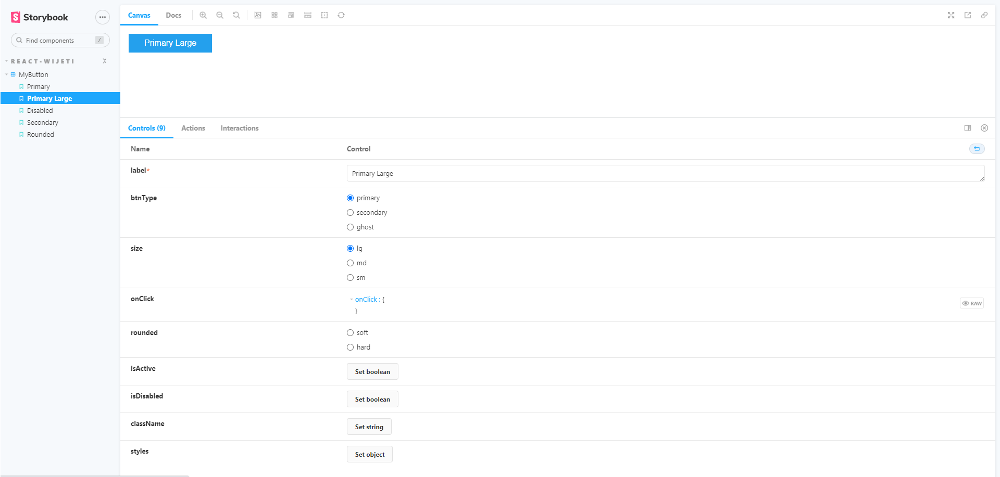

# React Wijeti
ReactJS useful components and utilities.


## Directory Structure
```text
<library-root>/
    |--- package.json       # Package json
    |--- tsconfig.json      # Typescript config
    |--- rollup.config.js   # Roll up config
    |--- .storybook/        # Storybook config
    |--- src/
           |--- index.ts
           |--- components/
                   |--- index.ts         # Include all components here
                   |--- <my-component>/  # Custom component
                             |--- <my-component>.types.ts
                             |--- <my-component>.css
                             |--- <my-component>.tsx
                             |--- <my-component>.stories.tsx
                             |--- index.ts
```

## Setup
If you are using git clone of this project, follow the following steps:

- **Install npm dependencies**
  ```shell
  npm install
  ```

- **Build library**
  ```shell
  npm run build
  ```
  The above command will generate a directory called `dist`,
  which is our build directory defined in the Rollup configurations.

- **Run Storybook**
  ```shell
  npm run storybook
  ```
  Open browser and got to http://localhost:6006/

  <br/>

  


## How this library was created?
**References**:
- https://blog.logrocket.com/build-component-library-react-typescript/
- https://javascript.plainenglish.io/react-component-library-with-ts-and-rollup-77aca0c727bf
- https://dev.to/alexeagleson/how-to-create-and-publish-a-react-component-library-2oe#adding-storybook


**Steps**:
- **Create a directory and initialize `package.json`**
    ```shell
    mkdir react-wijeti
    cd react-wijeti
    npm init
    ```
  Answer all questions to generate `package.json` file.

- **Install react, react-dom, typescript, types etc**
    ```shell
    npm i -D react react-dom typescript @types/react
    ```

- **Create a component following the following directory structure:**
  ```text
  <library-root>/
      |--- src/
             |--- components/
                     |--- <my-component>/
                               |--- <my-component>.types.ts
                               |--- <my-component>.css
                               |--- <my-component>.tsx
                               |--- index.ts
  ```

- **Add the newly created component in `src/components/index.ts`:**
  ```typescript
  import { default as MyButton } from "./MyButton";
  ```

- **Install other npm dependencies**
  ```shell
  npm i -D tslib
  ```

- **Configuring TypeScript**
  <br/>Add the TypeScript configurations (from the `tsconfig.json` file).
  ```shell
  npx tsc --init
  ```

- **Configuring Rollup**
  - Install rollup plugins
    ```shell
    npm i -D @rollup/plugin-node-resolve @rollup/plugin-commonjs @rollup/plugin-typescript rollup-plugin-peer-deps-external rollup-plugin-terser rollup-plugin-dts
    ```

  - First, install Rollup as a devDependencies project through the following command:
    ```shell
    npm i -D rollup
    ```

  - Create a `rollup.config.js` file in the root of our project.

- **Edit `package.json`**
  ```text
  {
    ...
    "main": "dist/cjs/index.js",
    "module": "dist/esm/index.js",
    ...
    "scripts": {
      ...
      "build": "rollup -c",
      ...
    }
  }
  ```

- **Build library**
  ```shell
  npm run build
  ```
  The above command will generate a directory called `dist`,
  which is our build directory defined in the Rollup configurations.

- **Integrating Storybook**
  <br/>The next step is to integrate Storybook into our library. Storybook
  is an open-source tool for building UI components and pages in isolation.
  Because we are building a component library it will help us to render our
  components and see how they behave under particular states or viewpoints.

  - Configure storybook:
    ```shell
    npx sb init
    ```
    When you execute the above code on your terminal, it will generate the
    directories `.storybook` and `stories` in your project. `.storybook` will
    hold all the configurations, and `stories` holds the stories for your
    component. A story is a unit that captures the rendered state of a UI
    component.

    The above command will also add some scripts (`storybook` and `build-storybook`)
    for our package.json file as well.

  - Delete unnecessary default stories from `src/stories` directory. Just keep
    assets folder and remove irrelevant story files.

  - Write a story for the component:
    <br/>Create a story file at `src/components/<my-component>/<my-component>.stories.tsx`

- **Run Storybook**:
  ```shell
  npm run storybook
  ```
  Open browser and got to http://localhost:6006/


## Development
Change component code while running storybook and observe the changes in the browser.


## Build
Run the following command to build your library
```shell
npm run build
```
The build files will be created inside `<library-root>/dist`


## Testing with Jest and React Testing Library
(Coming Soon)


## Packaging and publishing to npm
(Coming Soon)

